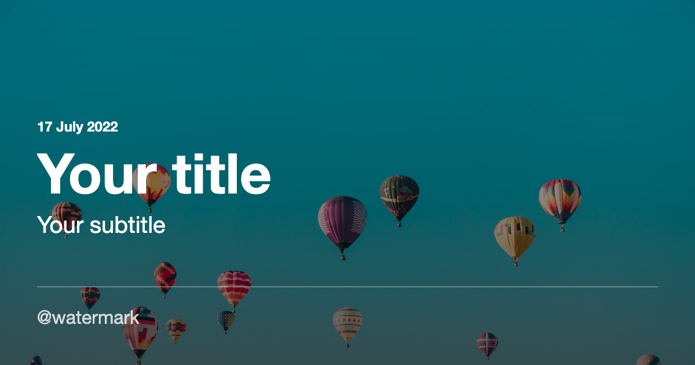
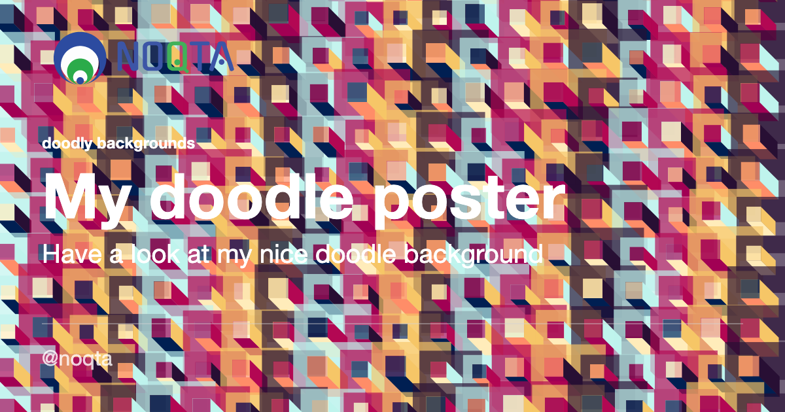
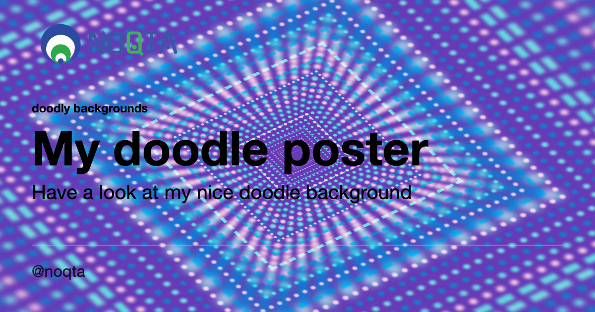
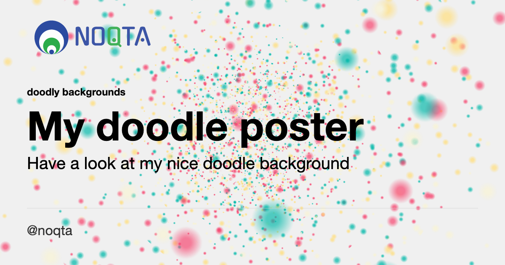
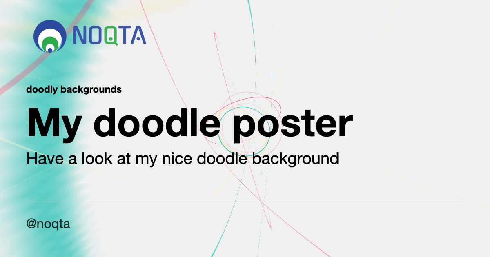
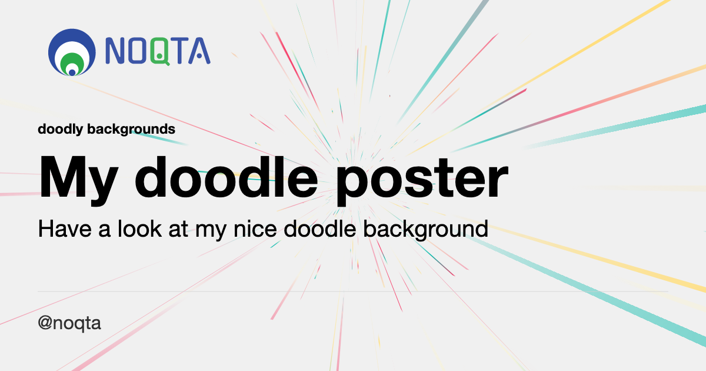
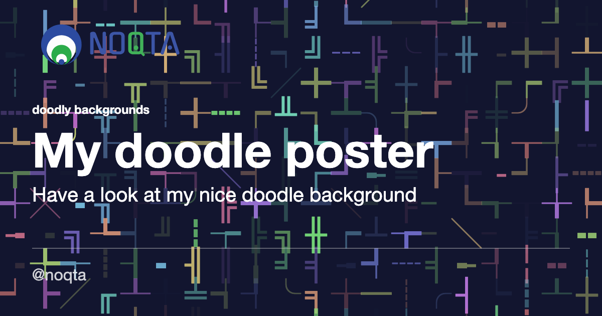
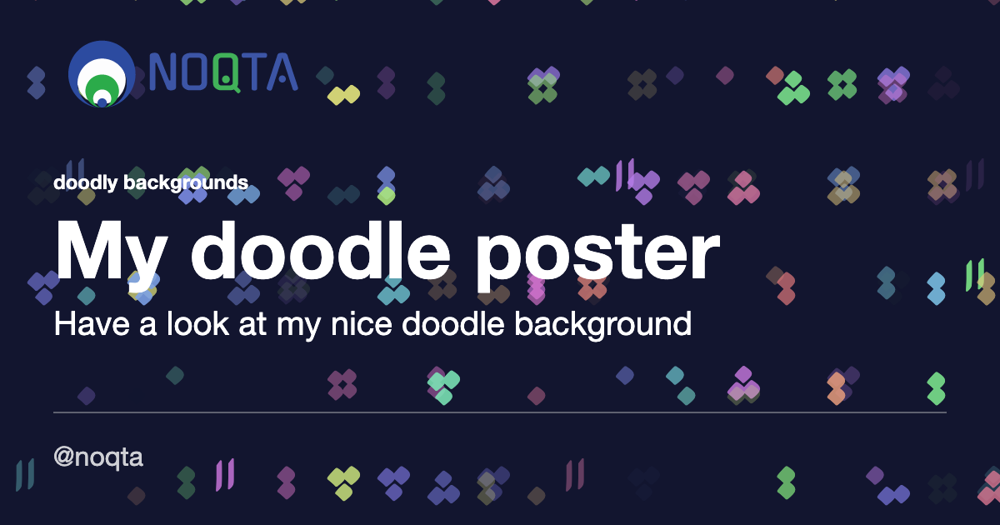

# Welcome to social-image-kodyfire 👋

[](https://github.com/nooqta/kodyfire#install-a-kody)
[](https://github.com/nooqta/kodyfire/blob/main/LICENSE)
[](https://twitter.com/anis\_marrouchi)

> Generate a dynamic image for social media sharing based on HTML templates using [Kodyfire](https://github.com/nooqta/kodyfire). This is just the beginning.

### 🏠 [Homepage](https://github.com/nooqta/kodyfire)

## Requirements

social-image-kodyfire requires the kodyfire-cli to be installed

```sh
npm install -g kodyfire-cli
```
## Install

```sh
npm install social-image-kodyfire
```

## Usage

### Method 1: As a generator
In order to generate your artifacts. The syntax is `kody generate|g [kody] [concept]`. If you ommit `kody` and `concept` the assistant will prompt you to select them. As an example, run the following command from your terminal:
```sh
kody generate react component
```
### Method 2: As a kody project
Refer to the kodyfire ["install a kody"](https://github.com/nooqta/kodyfire#install-a-kody) section.
Once your project is initialized and ready for kody, run the following command to generate your images.
```sh
kody run -s kody-social-image.json
```
### Available Templates 
#### `basic` (credits: [puppeteer-social-image](https://github.com/chrisvxd/puppeteer-social-image))

> Renders text on a background image.


##### Params

- `title` _string_ - text to render
- `logo` _string_ - URL for the logo
- `imageUrl` _string_ - URL for the background image
- `background` _string_ - Valid CSS background color
- `color` _string_ - Valid CSS color
- `watermark` _string_ - (optional) text for footer

#### `article` (credits: [puppeteer-social-image](https://github.com/chrisvxd/puppeteer-social-image))

> Display a title and subtitle on a background image, with an optional eyebrow



##### Params

- `title` _string_ - title text
- `subtitle` _string_ - subtitle text
- `eyebrow` _string_ - eyebrow text that renders above the title. Use for date
- `logo` _string_ - URL for the logo
- `imageUrl` _string_ - URL for the background image
- `background` _string_ - Valid CSS background color
- `color` _string_ - Valid CSS color
- `watermark` _string_ - (optional) text for footer


#### `fiftyfifty` (credits: [puppeteer-social-image](https://github.com/chrisvxd/puppeteer-social-image))

> Tempate with split content


##### Params

- `title` _string_ - title text
- `subtitle` _string_ - subtitle text
- `logo` _string_ - URL for the logo
- `imageUrl` _string_ - URL for the background image
- `background` _string_ - Valid CSS background color
- `color` _string_ - Valid CSS color
- `watermark` _string_ - (optional) text for footer

#### `doodle` (credits: [css-doodle](https://github.com/css-doodle/css-doodle))

> Tempate using the doodle-css as background

<table>
  <tr>
    <td>fakeBox</td>
     <td>neon</td>
     <td>seeding</td>
     <td>strings</td>
  </tr>
  <tr>
    <td></td>
    <td></td>
    <td></td>
    <td></td>
  </tr>
 </table>

 <table>
  <tr>
     <td>timeTravel</td>
     <td>tubes</td>
     <td>unicode</td>
  </tr>
  <tr>
    <td></td>
    <td></td>
    <td></td>
  </tr>
 </table>

##### Params

- `title` _string_ - title text
- `subtitle` _string_ - subtitle text
- `logo` _string_ - URL for the logo
- `doodle` _enum_ - doodle background name [fakeBox, neon, seeding, strings, timeTravel,tubes, unicode]
- `color` _string_ - Valid CSS color
- `watermark` _string_ - (optional) text for footer

Add the following params to your generated concepts. As an example, the final updated concepts might look like the following:
```json
{
      "name": "image-3",
      "template": "fiftyfifty.html.template",
      "split": "diagonal",
      "fontWeight": "medium",
      "fontSize": "80px",
      "title": "Hello World!",
      "subtitle": "Your subtitle",
      "eyebrow": "17 July 2022",
      "logo": "https://noqta.tn/_next/image?url=%2Fimages%2Flogo.svg&w=256&q=75",
      "background": "tranparent",
      "imageUrl": "https://images.unsplash.com/photo-1507608869274-d3177c8bb4c7?w=1950&q=80",
      "color": "#000",
      "includeWatermark": true,
      "watermark": "social-image-kodyfire",
      "size": "facebook",
      "outputDir": ""
    }
```
## 📅 Future Features
- Add common social post dimensions as size
- Allow passing arguments to doodles
- Compose doodle for dymamic backgrounds
- Add template for most common post subjects
- Add add meme template
## Run tests

```sh
TODO
```

## Author

👤 **Anis Marrouchi**

* Website: https://noqta.tn
* Twitter: [@anis\_marrouchi](https://twitter.com/anis\_marrouchi)
* GitHub: [@anis-marrouchi](https://github.com/anis-marrouchi)
* LinkedIn: [@marrouchi](https://linkedin.com/in/marrouchi)

## 🤝 Contributing

Contributions, issues and feature requests are welcome!

Feel free to check [issues page](https://github.com/anis-marrouchi/social-image-kodyfire/issues). 

## Show your support

Give a ⭐️ if this project helped you!

## Credits

- [puppeteer-social-image](https://github.com/chrisvxd/puppeteer-social-image) by [chrisvxd](https://github.com/chrisvxd) Big Thanks for the provided templates.
- [css-doodle](https://github.com/css-doodle/css-doodle) by [css-doodle](https://github.com/css-doodle) Beautiful work, We are so thankful.
- [puppeteer](https://github.com/puppeteer/puppeteer) by [puppeteer](https://github.com/puppeteer) Danke schone!

## 📝 License

Copyright © 2022 [Anis Marrouchi](https://github.com/anis-marrouchi).

This project is [MIT](https://github.com/nooqta/kodyfire/blob/main/LICENSE) licensed.

***
_This README was generated with ❤️ by [readme-kodyfire](https://github.com/nooqta/readme-kodyfire)_
